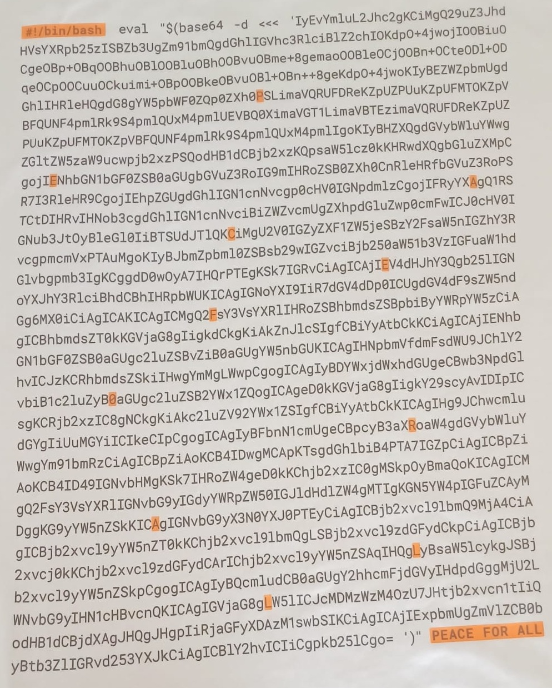

# Challenge Akamai / Uniqlo

J'ai acheté chez [Uniqlo](https://www.uniqlo.com/fr/fr/) un tshirt « PEACE FOR ALL » avec un gros Base64 écrit dessus.

Histoire de savoir ce que ça racontait, je l'ai décodé en Python. Comme je n'ai pas trouvé d'OCR capable de tout traduire sans erreur, j'ai dû tout vérifier et corriger à la main.

